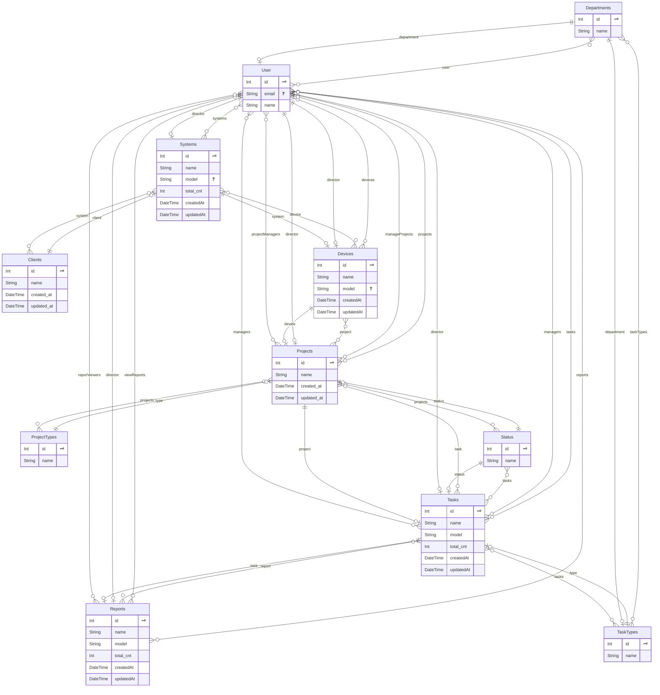

```mermaid
erDiagram

  "Departments" {
    Int id "🗝️"
    String name 
    }
  

  "TaskTypes" {
    Int id "🗝️"
    String name 
    }
  

  "User" {
    Int id "🗝️"
    String email "❓"
    String name 
    }
  

  "Clients" {
    Int id "🗝️"
    String name 
    DateTime created_at 
    DateTime updated_at 
    }
  

  "Systems" {
    Int id "🗝️"
    String name 
    String model "❓"
    Int total_cnt 
    DateTime createdAt 
    DateTime updatedAt 
    }
  

  "Devices" {
    Int id "🗝️"
    String name 
    String model "❓"
    DateTime createdAt 
    DateTime updatedAt 
    }
  

  "ProjectTypes" {
    Int id "🗝️"
    String name 
    }
  

  "Status" {
    Int id "🗝️"
    String name 
    }
  

  "Projects" {
    Int id "🗝️"
    String name 
    DateTime created_at 
    DateTime updated_at 
    }
  

  "Tasks" {
    Int id "🗝️"
    String name 
    String model 
    Int total_cnt 
    DateTime createdAt 
    DateTime updatedAt 
    }
  

  "Reports" {
    Int id "🗝️"
    String name 
    String model 
    Int total_cnt 
    DateTime createdAt 
    DateTime updatedAt 
    }
  
    "Departments" o{--}o "User" : "user"
    "Departments" o{--}o "TaskTypes" : "taskTypes"
    "TaskTypes" o|--|| "Departments" : "department"
    "TaskTypes" o{--}o "Tasks" : "tasks"
    "User" o|--|| "Departments" : "department"
    "User" o{--}o "Systems" : "systems"
    "User" o{--}o "Devices" : "devices"
    "User" o{--}o "Projects" : "projects"
    "User" o{--}o "Tasks" : "tasks"
    "User" o{--}o "Reports" : "reports"
    "User" o{--}o "Projects" : "manageProjects"
    "User" o{--}o "Tasks" : "managers"
    "User" o{--}o "Reports" : "viewReports"
    "Clients" o{--}o "Systems" : "system"
    "Systems" o|--|| "Clients" : "client"
    "Systems" o{--}o "Devices" : "device"
    "Systems" o|--|| "User" : "director"
    "Devices" o|--|| "User" : "director"
    "Devices" o|--|| "Systems" : "system"
    "Devices" o{--}o "Projects" : "project"
    "ProjectTypes" o{--}o "Projects" : "projects"
    "Status" o{--}o "Projects" : "projects"
    "Status" o{--}o "Tasks" : "tasks"
    "Projects" o|--|| "Status" : "status"
    "Projects" o|--|| "ProjectTypes" : "type"
    "Projects" o|--|| "User" : "director"
    "Projects" o|--|| "Devices" : "device"
    "Projects" o{--}o "Tasks" : "task"
    "Projects" o{--}o "User" : "projectManagers"
    "Tasks" o|--|| "Status" : "status"
    "Tasks" o|--|| "User" : "director"
    "Tasks" o|--|| "Projects" : "project"
    "Tasks" o{--}o "Reports" : "report"
    "Tasks" o|--|| "TaskTypes" : "type"
    "Tasks" o{--}o "User" : "managers"
    "Reports" o|--|| "User" : "director"
    "Reports" o|--|| "Tasks" : "task"
    "Reports" o{--}o "User" : "reporViewers"
```
